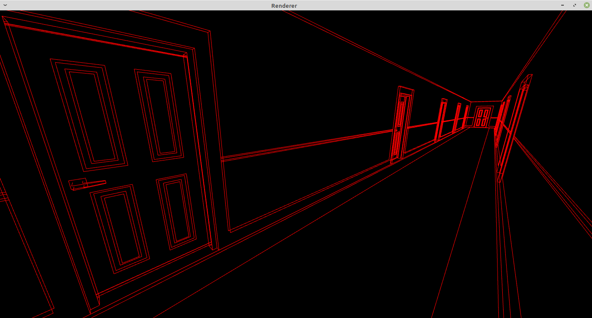
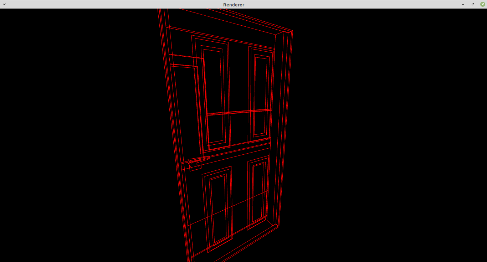

# 4DRenderer
A 4D / portal renderer written in assembly

I wrote this about a year ago and have mostly forgotten how to use it. All of the vertice data is embedded directly into the executable in a largely undocumented format.

The main functionalities are in `str.fragshader` and `str.vertshader` which are typical glsl shaders. The program should run fine other than there being one door which does not function for reasons I have long since forgotten.

Other than that and the portal intersection code being a bit buggy it works quite well.

